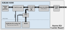

# RoCEv2 on Kria SOM (RoCKS)

This repository is an *RDMA over Converged Ethernet (RoCEv2)* implementation deployed on the AMD Kria KR260 Starter Kit [[1]][ref1]. Dummy data is streamed over the SFP+ 10 Gbps (optical) link into the memory of a RoCEv2-capable remote machine. The repository contains the full RoCEv2 stack [[2]][ref2] that lives in the FPGA fabric, a corresponding Linux driver, the complete Yocto distribution and a test program for the remote machine.

[ref1]: https://www.amd.com/en/products/system-on-modules/kria/k26/kr260-robotics-starter-kit.html "https://www.amd.com/en/products/system-on-modules/kria/k26/kr260-robotics-starter-kit.html"

[ref2]: https://github.com/fpgasystems/fpga-network-stack "https://github.com/fpgasystems/fpga-network-stack"



*Figure 1: RoCEv2 on Kria SOM (RoCKS) architecture*


## Prerequisites

- Build machine: Ubuntu 24.04.5 LTS
- Hardware: AMD Kria KR260 Starter Kit [[1]][ref1]


## Setup build environment

1. Build Yocto docker image
```bash
cd docker
source build_docker.sh
```

2. Fetch AMD/Xilinx Yocto sources
```bash
sudo apt-get install repo
repo init -u https://github.com/Xilinx/yocto-manifests.git -b rel-v2025.2 -m default-edf.xml
repo sync
```

3. Run Yocto build environment, add custom layer
```bash
docker compose run --rm yocto
source edf-init-build-env
bitbake-layers add-layer ../meta-rocks
```


## Generate, deploy target image

> **_Note:_** Precompiled SDT/bitstream is used. Refer to *ProgrammableLogic*, in case FPGA design needs to be modified and recompiled.

1. Generate custom machine, build image
```bash
docker compose run --rm yocto
gen-machine-conf parse-sdt \
    --template ../sources/meta-kria/conf/machineyaml/k26-smk-kr-sdt.yaml \
    --hw-description ../meta-rocks/ProgrammableLogic/rocks_sdt.tar.gz \
    --machine-name rocks \
    -g dfx
MACHINE=rocks bitbake kria-image-full-cmdline
```

2. Write `*.wic` image to sd-card (e.g. balenaEtcher)


## Testing

The test setup consists of the AMD Kria KR260 Starter Kit whose SFP+ interface is connected to a Mellanox ConnectX-6 Lx [[3]][ref3] NIC which is attached to the remote machine (x86_64 running Ubuntu 24.04.5 LTS). The IP addresses of the Kria KR260 are preconfigured, i.e. the RoCEv2 interface is on `192.168.1.20` and the APU network interface on `192.168.1.21`.

The Kria KR260 sends 1000 `RDMA WRITE` followed by one `RDMA SEND`. Both, `RDMA WRITE` and `RDMA SEND` have a payload of 2048 bytes.

[ref3]: https://www.nvidia.com/en-in/networking/ethernet/connectx-6-lx/ "https://www.nvidia.com/en-in/networking/ethernet/connectx-6-lx/"

```ditaa
+----------------------+                                         +-----------------------------+  
|    AMD Kria KR260    |                                         |       Remote Machine        |
|      Starter Kit     |                                         | (x86_64 Ubuntu 24.04.5 LTS) |
|                      |                  +---------------+      |                             |
|                      |   10 Gbps link   |    Mellanox   | PCIe |                             |
| RoCEv2: 192.168.1.20 |------------------| ConnectX-6 Lx |======| 192.168.1.22                |
| APU:    192.168.1.21 |                  |      NIC      |      |                             |
+----------------------+                  +---------------+      +-----------------------------+
```
*Figure 2: Test setup*


1. Setup network interface on remote machine
```bash
sudo ip addr add 192.168.1.22/24 dev <interface>
sudo ip link set mtu 4200 dev <interface>
```

2. To prevent packet loss, the RoCEv2 stack internal ARP cache must be loaded. This can be achieved with ping.
```bash
ping 192.168.1.20 -c 2
```

3. Compile, run test program on remote machine
```bash
cd test
g++ remote_tester.cpp -o remote_tester -lrdmacm -libverbs -lboost_program_options
./remote_tester
```

4. Run test program on the Kria KR260 (compiled into image)
```bash
sudo rdma-test
```

If the test was successful, the output will look as follows.

```
Started rdma-test with remote IP: 192.168.1.22 and port: 8000
Created socket
Connected to remote
Request sent to remote
Received parameters from remote: rkey=0x00182e00, psn=0x00000001, remote_qpn=0x000000b9, remote_ip=0x1601a8c0, vaddr=0x0000721cca8ee010, iterations=1000, length=2048

Test successful!

---------------- Counters ----------------
RX frames                   1001
TX frames                   1001
Retransmission frames       0
CRC drop frames             0
Invalid PSN drop frames     0

--------------- Statistics ---------------
RoCEv2 throughput           9.454 Gbps
```


## Contributors

`RoCEv2 on Kria SOM` was developed by Michael Jost at ETH Zurich. Krishna LeMoing contributed large parts of the HDL built around `fpga-network-stack`, the Linux device driver and the test routines during his Master Thesis at ETH Zurich.

Furthermore, the following submodules are part of this project.

- [`fpga-network-stack`](https://github.com/fpgasystems/fpga-network-stack), the core RoCEv2 IP written in HLS, developed by the Systems Group of ETH Zurich. It's published under the BSD-3-Clause license.

- [`half-switch`](https://github.com/fimtrey/verilog-ethernet-axis-half-switch), a Layer 2 Ethernet half-switch in Verilog, developed by Tim Frey at ETH Zurich. It's published under the Apache-2.0 license.

- [`verilog-ethernet`](https://github.com/vmayoral/verilog-ethernet), various Verilog Ethernet components, developed by vmayoral for the AMD Kria KR260 based on Alex Forencich's library. It's published under the MIT license.


## Citation

If you use `RoCEv2 on Kria SOM` in your work, please cite this repository. Formal citation metadata will be added in a future release.
